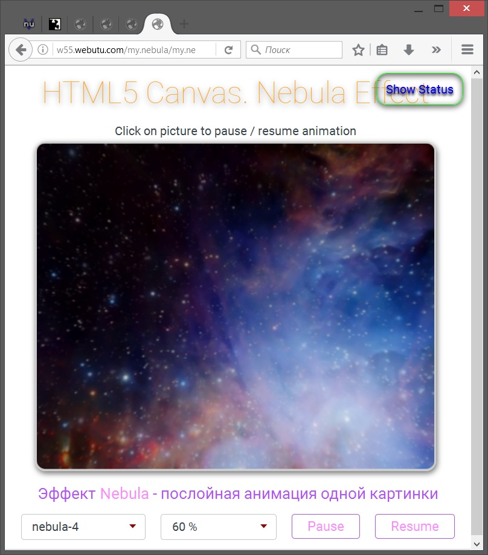

# my.nebula
<a href="http://htmlbook.ru/html5">HTML5</a> animation example that uses tag <a href="http://htmlbook.ru/html/canvas">canvas</a> and JavaScript to draw on it.
 
<b>Nebula</b> animation effect - HTML5 animation of a one big picture.
 
This example based on original work of <b>Professor Cloud</b> <a href="http://www.professorcloud.com/mainsite/canvas-nebula.htm">Experiment - HTML5 Canvas Nebula</a> .

Take a look: <a href="http://w55.webutu.com/my.nebula/my.nebula.html">DEMO PAGE</a>.

This example uses HTML5, CSS3 and JQuery.
